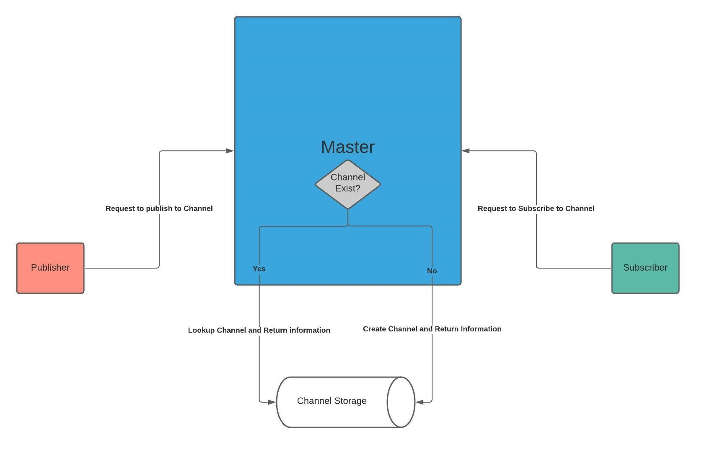
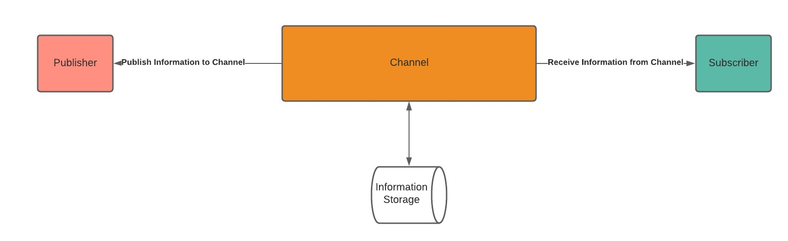

# TALA
## Distributed Communications

### Goal
The goal of TALA is to have a fast and easy distributed communication system that that someone could use without deep knowledge of sockets or ZeroMQ.

### Overview
TALA will be a Publisher-Subscriber based project where the user will decide if they want to subscribe or publish to a specific channel. The handling of communications is done by a Master. This Master is the only connection information that the user needs to know. The Master handles the creation of new Channels if a Publisher requests a new one. The Master will handle the returning of a Publisher/Subscriber object that contains the Channel connection information back to the user. The user will not need to know the Channels connection information and may never even see it. 
 
 
Publishers will only be able to send data to a Channel, they are also able to publish to multiple Channels.
Subscribers will only be able to receive data from a Channel, they are also able to receive from multiple Channels.
Channels will handle the storage of data independently from Publishers and Subscribers.

<!-- This is all temporary 
### Requirements/Building/Installation

##### Requirements
[Check with team]
Cargo >=1.46.0 \
Maturin >=0.8.3 \
Python 3.X \
PIP >=20.2.3 \
Julia >=1.5.1 \
Windows/Linux \

##### Steps for Building from Source
[Assuming we finish install scripts for both windows and linux]
[Add any special commands for building]
1. On Windows run install.bat, on Linux run install.sh. This should take some time since it is installing and building everything
2. Go to Build/Libs for direct libraries, Build/Wheel for Python wheels.   

##### Installation
[For these maybe even have a script to install by langauge (python/julia])]\
Python: run pip install [name for wheel file] from the Build/Wheel folder. [Or pip install TALA if available]   
Julia: [Figure this one out][probably a julia script to run]

### Using TALA
[How to use this should come soon]
-->
